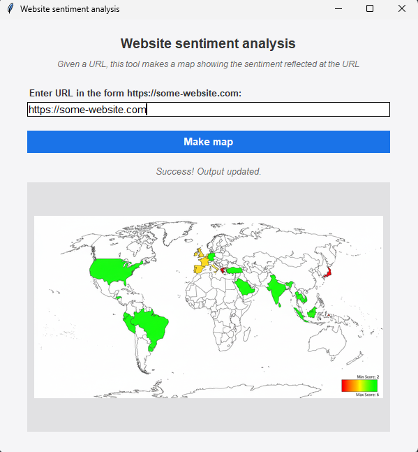

# webpage-sentiment-analysis-using-LLM

Use an LLM to determine the sentiment from a website, and make a shaded map showing sentiment. It uses Chain-of-Thought prompting to guide an LLM. Upon running the main(), your output should look
like this. Green is the most positive sentiment and red is the most negative sentiment.

. 

## Requirements

You will need the following packages: pillow, google-genai, playwright.

In load_data.py, you will need to enter your Google GenAI API key on this line: os.environ["GOOGLE_API_KEY"] = "your_API_key"
